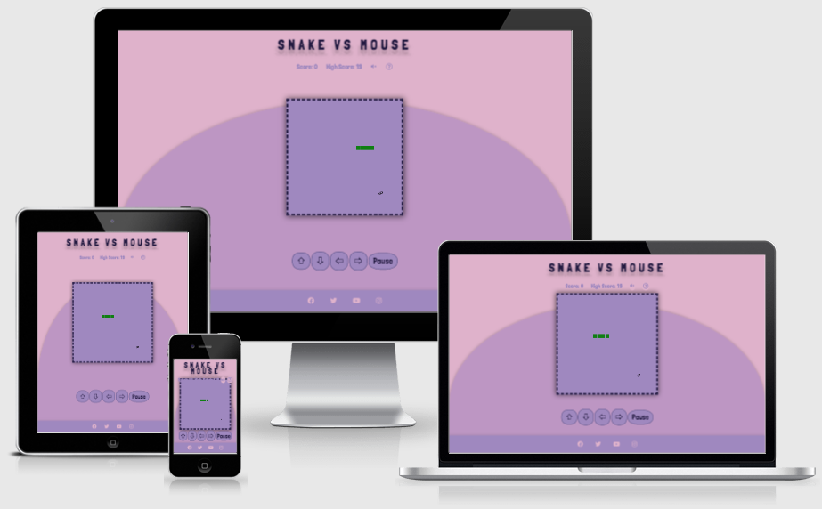
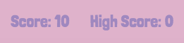

# SNAKE VS MOUSE

<a href="https://sara5491.github.io/snakevsmouse/">Play the game</a>

'Snake vs Mouse' is an online game inspired by the classic 'Snake' video game where the user tries to eat as much 'food' as they can without running into the tail of the snake. It is a very simple concept but very addictive!

The idea is to guide the snake using the arrows on a keyboard or the controls on the screen to try and eat as many 'mice'
as possible. Each time a mouse is eaten, the snake grows longer and a point is scored.

- [SNAKE VS MOUSE](#snake-vs-mouse)
  * [TABLE OF CONTENTS](#table-of-contents)
  * [PLANNING](#planning)
    + [Project Goals](#project-goals)
    + [User Goals](#user-goals)
    + [User Stories](#user-stories)
    + [Design Goals](#design-goals)
    + [Design Choices](#design-choices)
      - [Layout](#layout)
      - [Font](#font)
      - [Colours](#colours)
      - [Images](#images)
      - [Audio](#audio)
      - [Wireframes](#wireframes)
  * [FEATURES](#features)
      - [Current features](#current-features)
      - [Future implementation](#future-implementation)
  * [TESTING](#testing)
      - [Responsiveness](#responsiveness)
      - [Lighthouse](#lighthouse)
      - [Validators](#validators)
  * [BUGS](#bugs)
      - [Fixed Bugs](#fixed-bugs)
      - [Known Bugs](#known-bugs)
  * [TECHNOLOGIES USED](#technologies-used)
      - [Languages](#languages)
      - [Libraries/Online Resources](#libraries-online-resources)
  * [DEPLOYMENT](#deployment)
  * [CREDITS](#credits)
      - [Content](#content)
      - [Media](#media)
      - [Thanks](#thanks)

<small><i><a href='http://ecotrust-canada.github.io/markdown-toc/'>Table of contents generated with markdown-toc</a></i></small>

## PLANNING
### Project Goals
The aim is to create an interactive, fun game that is easy to play. It should be enjoyable so players want to play it
again and again.

### User Goals
The game should be simple enough that it can be played during a short period e.g. while in a doctor's waiting room or on a work break. It should entice the user to keep coming back to it, to try and beat their high score.

### User Stories
- As a user I want to immediately understand how to play the game.
- As a user I want to be able to see my progress (via scores).
- As a user I want to be able to complete the game within a short time frame.
- As a user I want to view game instructions, if necessary.
- As a user I want to play the game on a mobile phone or computer.
- As a user I want to play a simple and straightforward game.
- As a user I want to easily mute the audio of the game.

### Design Goals
I wanted to create a game that is easy to use, can be played on multiple devices, has simple controls and is designed with complementary colours.

### Design Choices
#### Layout
- The game area is in the centre of the page, with the 'snake' displayed as green cells and the 'food' displayed as an image of a mouse.
- The player's current score, their high score, the audio player button and the instructions are clearly shown above the game area.
- The instructions open in a container when the ? icon is clicked on.  
  
- Arrows which can be used to control the snake on both computers and mobile devices are displayed underneath the game area.  

- A pause button is displayed alongside the arrow controls. The game can also be paused (and started again) by pressing the spacebar.
- A footer with social media links is shown at the bottom of the page on all devices.
- A lilac half-oval shape with a shadow is the main feature of the background which gives the page more depth.

#### Font
I used only one font throughout - <a href="https://fonts.google.com/specimen/Londrina+Solid">Londrina Solid.</a> It has a playful, youthful feel which suits the design and style of the page.

#### Colours
I wanted to choose pastel, 'feminine' colours as a contrast to the original 'Snake' game which I remember being very dark, plain with almost garish red and green colours.
I used <a href="https://coolors.co">Coolors</a> to generate a colour palette - shades of pinks and purples - which are calming and pleasant.

#### Images
I used an image of a mouse, rather than a plain coloured cell as the 'food' because I felt like it gives the game a bit of humour. I also think it makes it different from the other Snake games that are out there. I used a snake favicon so if a user has lots of tabs open in their browser, it is obvious which tab is the game.  

#### Audio
There are two different sounds within the game - a squeak when the snake eats a mouse and a negative 'bong' sound when the snake runs into itself and it's game over. The audio is muted when the game begins but can be toggled on and off by clicking on the speaker icon.

#### Wireframes
Wireframes for desktop and mobile can be found here:
- <a href="https://github.com/sara5491/snakevsmouse/blob/main/wireframes/wireframecanvas.png">Game area</a>
- <a href="https://github.com/sara5491/snakevsmouse/blob/main/wireframes/wireframeoverview.png">Desktop overview</a>
- <a href="https://github.com/sara5491/snakevsmouse/blob/main/wireframes/wireframeinstructions.png">Instructions container</a>
- <a href="https://github.com/sara5491/snakevsmouse/blob/main/wireframes/wireframemobile.png">Mobile phone</a>  
I was originally going to have the touch controls on the right-hand side of the game area but I found it more user-friendly to have them underneath, especially on a mobile phone.  

## FEATURES
#### Current features
- I created a popup using <a href="https://sweetalert2.github.io/">SweetAlert</a> for when the snake touches its tail and the game is over.

- There are no 'walls' in the game area. This makes each game last longer as it is easier to play than when the snake is confined to a small square.
- High scores - each player's score is saved in local storage so if the game is ended and returned to at a later date, the player's high score is still there. This will encourage users to return to the game.

#### Future implementation
- Leaderboard - shows all players' high scores so the game becomes more competitive.
- Customisation - players are able to change the speed of the snake/the colours on the page/different food icons.
- Touch screen controls - the ability to swipe the screen in order to change direction.
- Obstacles - items that stand in the way of the snake and its food.
- Snake head - add an icon/design to the head of the snake e.g. eyes and a tongue.

## TESTING
#### Responsiveness
Responsive on all devices and screens sizes available on Chrome DevTools. The game is fully responsive in portrait mode and the game area scales down by device size.
#### Lighthouse
Desktop  
 

Mobile
 
#### Validators
The HTML file was run through (https://validator.w3.org/) and the CSS file was run through (https://jigsaw.w3.org/css-validator/) and no errors were found. For JavaScript, the file was run through (https://jshint.com/) and no errors were found.

## BUGS
#### Fixed Bugs
I came across many bugs while creating my game and managed to fix most of them as I went along:  
1) Snake wasn't increasing in size after eating mouse.  
- Added unshift to add extra square to snake body.  
2) Snake was eating mouse but it wasn't disappearing.  
- I used the pop array method to make sure it was being removed.
3) Score was updating but high score wasn't.  
  
- This was originally working but then I accidentally deleted one line of code (without realising). Once I discovered what I had done, I re-added the 'localStorage' line back in and the high score was updating again.  
4) Audio and Instructions buttons were appearing over the shadow of the game area.  
.  
- I sorted this out by making the background colour of the buttons transparent and removing the border.  
  

#### Known Bugs / Future Fixes
- Squeak sound - the sound doesn't always play if one mouse is eaten straight after another.
- If the keyboard arrow keys are pressed too quickly after each other, the snake runs into itself.

## TECHNOLOGIES USED
#### Languages
- HTML
- CSS
- JavaScript

#### Libraries/Online Resources
- [Sweet Alert](https://sweetalert2.github.io/) - to create game over alert
- [MixKit](https://mixkit.co/) - for sound effects
- [Google Fonts](https://fonts.google.com/) - to select and import font
- [FontAwesome](https://fontawesome.com/) - used to add icons
- [GitHub](https://github.com/) - project code stored in GitHub after being pushed
- [GitPod](https://gitpod.io/workspaces) - used to develop the website
- [Chrome DevTools](https://developer.chrome.com/docs/devtools/) - used extensively during developing and design process
- [Balsamiq](https://balsamiq.com/) - used to create wireframes
- [AmIResponsive?](http://ami.responsivedesign.is/) - used to check the responsiveness on different devices
- [Coolors](https://coolors.co/) - used to decide on generate colour palette
- [Favicon](https://favicon.io/) - used to add a snake icon to the user's tab
- [Lighthouse](https://developers.google.com/web/tools/lighthouse) - used to test performance of the site
- [W3C](https://validator.w3.org/) - HTML and CSS validators
- [Flaticon](https://www.flaticon.com/) - mouse icon

## DEPLOYMENT
The project was created in GitPod and deployed to GitHub using the following steps:

1. Log into GitHub
2. Locate the repository (sara5491/snakevsmouse)
3. Click ‘Settings’ and locate ‘Pages’ on the left-hand side
4. Under ’Source’ select ‘Branch: Main’ and click ‘Save’
5. Wait a few minutes for the site to be deployed. It will be accessible at: https://sara5491.github.io/snakevsmouse/

Forking a repository - this allows you to contribute to someone else's project

1. Log into GitHub
2. Locate the repository
3. Click ‘Fork’ at the top right-hand corner of the page
4. This creates a copy of the repo in your own GitHub account

Cloning a repository

1. Locate the repository
2. Above the files, locate the ‘Code’ button
3. To clone the repository using HTTPS, copy the link under 'Clone with HTTPS’
4. Open a terminal
5. Change the working directory to the location you want the cloned directory to be made to
6. Type ‘git clone’ and paste the URL you have copied
7. Press ‘enter’ to create your clone

Instructions from [GitHub Docs](https://docs.github.com/en/github/creating-cloning-and-archiving-repositories)

## CREDITS
#### Content
I was inspired by this [Snake game](https://gist.github.com/straker/ff00b4b49669ad3dec890306d348adc4) for the basic idea and outline of the game however I added many different features.  
This [tutorial](https://www.educative.io/blog/javascript-snake-game-tutorial) along with [this one](https://www.freecodecamp.org/news/how-to-build-a-snake-game-in-javascript/) were helpful in the creation of my game.  
[W3Schools](https://www.w3schools.com/graphics/game_controllers.asp) - game controllers.  
[W3Schools](https://www.w3schools.com/graphics/game_movement.asp) - movement.
[Mozilla](https://developer.mozilla.org/en-US/docs/Games/Anatomy) - game loops.

#### Media
- Sound effects were found on [MixKit](https://mixkit.co/)
- Mouse icon was from [Flaticon](https://www.flaticon.com/)
- Icons were found on [FontAwesome](https://fontawesome.com/)
- Arrow symbols for the controls are from [SymbolCopy](www.symbolcopy.com)  

#### Thanks
The Slack community for their help and guidance.
